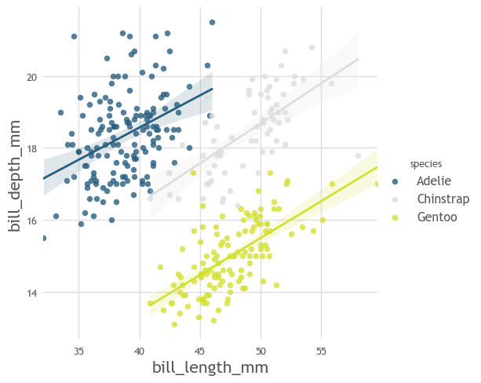
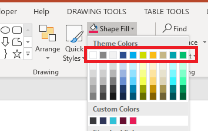

Themes
======

What is a theme ?
-----------------

A theme is a set of predifined styles for visuals. Themes are aligned with the PowerPoint styles.
A theme is roughly the sum of 4 things:

* a font
* a set of base colors defining the style
* a set of auto-generated color maps
* a set of default styles for all matplotlib/matplotlib-derived graphs (this is done under-the-hood by declaring a
new ``RcParams``in matplotlib)

Loading themes
--------------

Custom themes can be loaded very easily following the routine:

>>> from mpl_themes_utils.themes import set_theme
>>> set_theme("mpl-themes-blue")

Once the loading is completed, all the graphs will be applied theme style.
You will also have access to the theme's custom colors and colormaps through the regular matplotlib colors and
color maps registry. For instance:

>>> import seaborn as sns
>>> df = sns.load_dataset("penguins")
>>> sns.lmplot(
    data=df,
    x="bill_length_mm",
    y="bill_depth_mm",
    hue="species",
    palette="mpl-themes-blue:c_blue_yellow",
)

Natively available themes
-------------------------

.. toctree::
   :maxdepth: 2
   :titlesonly:

   mpl-themes-green/green_generic_theme.rst
   mpl-themes-blue/blue_generic_theme.rst

Creating new themes
-------------------

If you want to create a new theme not included natively in ``mpl_themes_utils``, don't worry!
You can setup yours in a few minutes. All you need to do is to use the theme ``Template`` object and
provide it with a font name and a few mandatory colors (the ones you can get from PowerPoint).

First thing to do is to open your PowerPoint presentation theme and copy its main RGB color codes:

Then, simply create a new theme by declaring font and color codes:

.. code-block:: python

    from .themes import Theme
    from  mpl_themes_utils.themes import Color

    default_red = Color("magenta", 231, 28, 87)
    default_green = Color("green", 0, 191, 111)
    default_blue = Color("blue", 44, 77, 142)
    default_yellow = Color("gold", 250, 188, 21)

    my_theme = Theme(
        name="my_theme",
        background1=Color("white", 255, 255, 255),
        background2=Color("off_white", 242, 242, 242),
        text1=Color("gray", 134, 134, 134),
        text2=default_blue,
        accent1=Color("turquoise", 0, 172, 236),
        accent2=Color("lime", 206, 220, 0),
        accent3=default_yellow,
        accent4=Color("tan", 197, 183, 134),
        accent5=Color("teal", 0, 163, 173),
        accent6=default_green,
        default_blue=default_blue,
        default_green=default_green,
        default_yellow=default_yellow,
        default_red=default_red,
        font="Trebuchet MS",
        custom_colors=[default_red],
    )

Finally, set the theme!

>>> from  mpl_themes_utils.themes import set_theme
>>> set_theme(my_theme)
