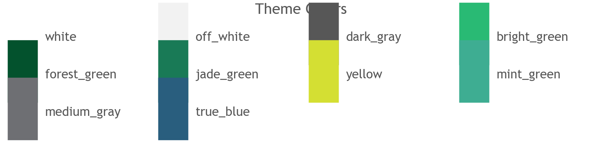
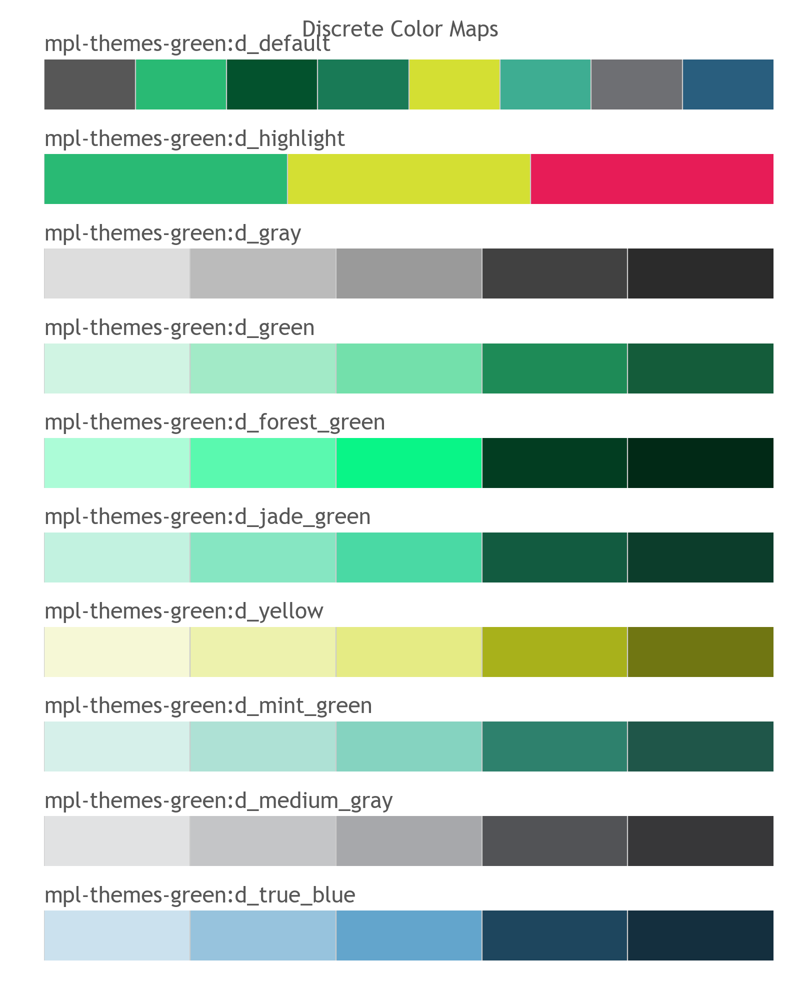
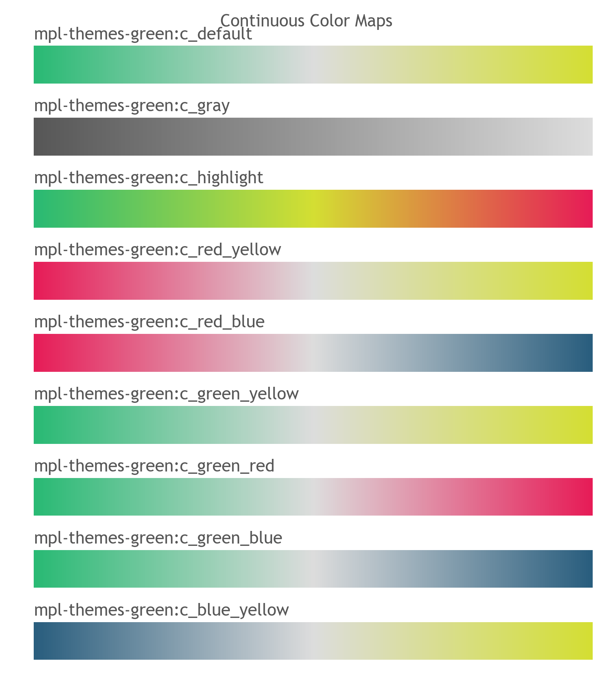
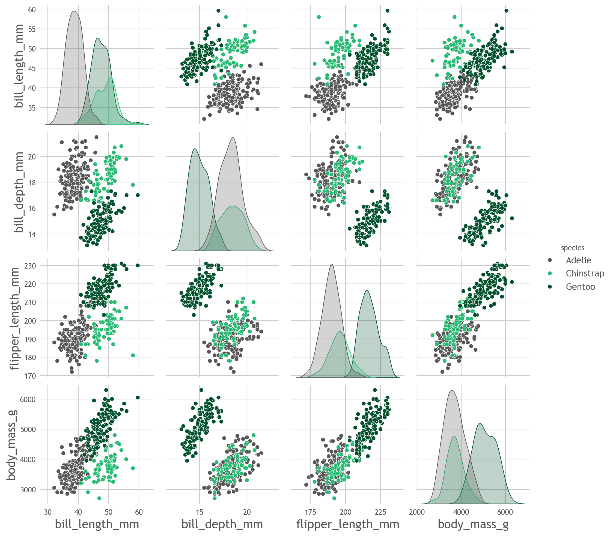

Generic Green Theme
===================

Usage
-----

>>> from  mpl_themes_utils.themes import set_theme
>>> set_theme("mpl-themes-green")

Theme features
--------------

Examples
--------

.. code-block:: python

    import seaborn as sns
    df = sns.load_dataset("penguins")
    sns.pairplot(df, hue="species")

